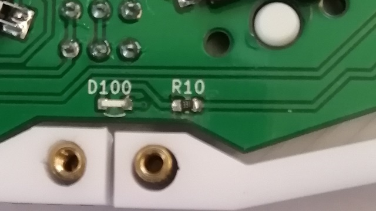
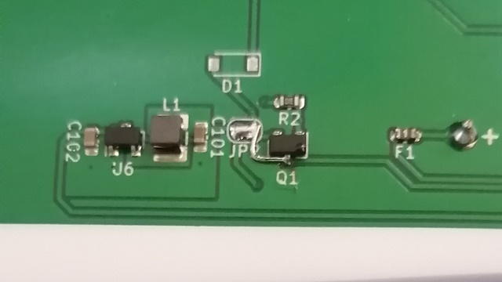
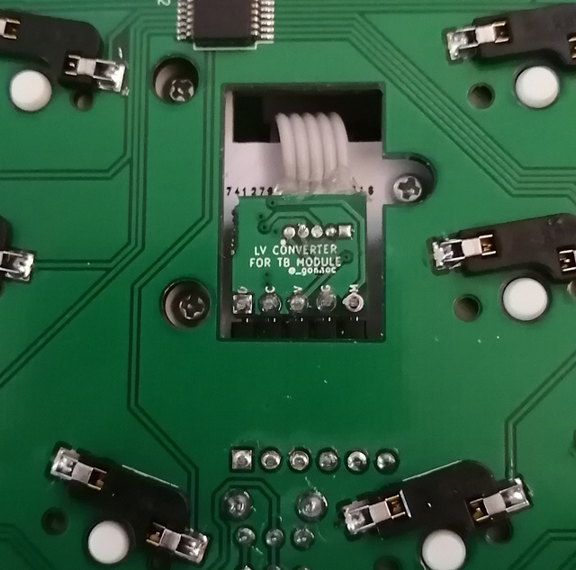

# Kugel-1 ビルドガイド

自作キーボードキットKugel-1のビルドガイドです  
組立前に必ず一回以上確認してください

[rev1のビルドガイドはこちら](https://github.com/sekigon-gonnoc/Kugel-doc/tree/v0.6.0-0)

[BOOTHにて販売中です](https://nogikes.booth.pm/items/1655318)

- [使用上の注意](#使用上の注意)
- [準備](#準備)
  - [キット内容の確認](#キット内容の確認)
  - [別途必要な部品](#別途必要な部品)
  - [工具の確認](#工具の確認)
- [組み立て手順](#組み立て手順)
  - [alpha版ワークアラウンド](#alpha版ワークアラウンド)
  - [スイッチソケットのはんだ付け](#スイッチソケットのはんだ付け)
  - [トラックボールモジュールを変換基板にハンダ付けする](#トラックボールモジュールを変換基板にハンダ付けする)
  - [リセットスイッチ、電源スイッチを差し込む](#リセットスイッチ電源スイッチを差し込む)
  - [トッププレート、スイッチを取り付ける](#トッププレートスイッチを取り付ける)
  - [トラックボールモジュールを取り付ける](#トラックボールモジュールを取り付ける)
  - [リセットスイッチ、電源スイッチ、電池ボックスをはんだ付けする](#リセットスイッチ電源スイッチ電池ボックスをはんだ付けする)
  - [スペーサーを取り付ける](#スペーサーを取り付ける)
  - [BLE Micro Proを取り付けて動作確認する](#ble-micro-proを取り付けて動作確認する)
  - [ミドルプレート、ボトムプレートを取り付ける](#ミドルプレートボトムプレートを取り付ける)
  - [キーキャップを取り付ける](#キーキャップを取り付ける)
  - [トラックボールの設定について](#トラックボールの設定について)

## 使用上の注意
- 使用中に電池などから発熱を感じた場合、直ちに使用を中止し、電源を切ってください

## 準備
### キット内容の確認
- メインPCB x1
- トップPCB x1
- ボトムPCB x1
- アクリルミドルプレート x1
- 電池ボックス x1
- 電源スイッチ x1
- リセットスイッチ x1
- トラックボールモジュール用変換基板 x1
- L字ピンソケット x1
- L字ピンヘッダ x1
- M2x5ねじ x25
- M2x3ねじ x3
- M2x8スペーサー x11
- M2x6.5スペーサー x3
- M2x4スペーサー x3
- alpha版ワークアラウンド用部品
  - 330Ωチップ抵抗(1608) x1+予備

<details><summary>パーツ画像一覧</summary>
<p>

| <br>     |
| ---------------------------------- |
| メインPCB 1個                      |
| <br>     |
| ボトムPCB 1個                      |
| <br>     |
| トップPCB 1個                      |
| <br>     |
| ミドルプレート 1個                 |
| <br>     |
| BLE Micro Proカバー 1個            |
| <br>     |
| リセットスイッチ 1個               |
| <br>     |
| 電源スイッチ 1個                   |
| <br>     |
| 単三電池ケース 1個                 |
| <br>     |
| ネジ M2x5 25個                     |
| <br>     |
| ネジ M2x3 3個                      |
| <br>     |
| スペーサ M2x8 11個                 |
| <br>     |
| スペーサ M2x5 3個                  |

</p>
</details>

### 別途必要な部品
- BLE Micro Pro x1
  - [BOOTH](https://nogikes.booth.pm/items/1177319), [遊舎工房](https://yushakobo.jp/shop/ble-micro-pro/)にて販売中
- コンスルーまたはピンヘッダ x2
- 7mm オプティカルトラックボールモジュール (1Uタイプ) x1
- アルカリ電池またはNi-MH電池 x1
  - 無線動作させる場合は1.2~1.5Vの電池が必要です
- MXソケット x43
- MX互換スイッチ x43
- MX用キーキャップ(1U) x43

<details><summary>パーツ画像一覧</summary>
<p>

| <br> |
| ------------------------------ |
| BLE Micro Pro 1個              |
| <br> |
| コンスルー 2個                 |

</p>
</details>

### 工具の確認
- ハンダコテ、はんだ
- ニッパー
- ドライバー
- マスキングテープ

## 組み立て手順
1. スイッチソケットをはんだ付けする
1. トラックボールモジュールを変換基板にハンダ付けする
1. リセットスイッチ、電源スイッチを差し込む
1. トッププレート、スイッチを取り付ける
1. トラックボールを取り付ける
1. リセットスイッチ、電源スイッチ、電池ボックスをはんだ付けする
1. スペーサーを取り付ける
1. BLE Micro Proを取り付けて動作確認する
1. ミドルプレート、ボトムプレートを取り付ける

### alpha版ワークアラウンド
- LED用の抵抗を付け直してください
  - この修正でLEDが確認できる程度に明るくなります
  - もともと付いている抵抗を外しにくい場合は新しい抵抗を並列にとりつけるだけでも構いません 
   
- Q1の2, 3番ピンをショートさせてください
  - この修正で電池を最後まで使い切ることができるようになります
  - また、電源スイッチをONにした状態でUSBケーブルを繋いだときに電池から流れ込んでしまう電流を減らせます
   

### スイッチソケットのはんだ付け


- スイッチ用ソケットをはんだ付けしていきます  
  - ソケットが浮き上がらないように注意してください  
  - 端子の左右にフィレットができるようにしっかりハンダを盛ってください

### トラックボールモジュールを変換基板にハンダ付けする
- 向きに注意してトラックボールモジュールのケーブルを変換基板にはんだ付けします
- 実装基板にL字ピンソケットを、変換基板にL字ピンヘッダをそれぞれはんだ付けします


### リセットスイッチ、電源スイッチを差し込む
- リセットスイッチ、電源スイッチを差し込みます。**はんだ付けはまだしないでください**

### トッププレート、スイッチを取り付ける
- トッププレートの上からスイッチをメインPCBに取り付けていきます  
  - ソケットが剥がれないようにメインPCBを机の上に載せて、真上からスイッチを押し込んでください
  - スイッチの足が机を傷つけないように上に作業用マットを敷いておきましよう  
- 4つくらいスイッチを取り付けるとトッププレートとメインPCBの位置関係が固定されます。リセットスイッチと電源スイッチがトッププレートの穴から操作できることを確認しておきましょう  
- スイッチの爪がトッププレートにはまっていることを確認しながら残りのスイッチを一個ずつ取り付けてください  

### トラックボールモジュールを取り付ける

- 4 mmのオス-メススペーサーを裏側からトッププレートにm2*3のなべねじでネジ止めします
- 変換基板をピンソケットに差し込みます
- 余ったケーブルを挟むようにして、トラックボール用プレートを4mmスペーサーに差し込み、上から6.5mmのスペーサーで固定します
- トラックボールカバーでトラックボールモジュールを覆うようにしてm2ネジで固定します

### リセットスイッチ、電源スイッチ、電池ボックスをはんだ付けする


- リセットスイッチ、電源スイッチをはんだ付けします
- 電池ボックスを差し込み裏側からはんだ付けします。
  - なるべく電池ボックスの足が飛び出ないようにニッパーで切断してからはんだ付けしてください

### スペーサーを取り付ける

- 8mmのスペーサーをトッププレートの外周部にネジ止めします

### BLE Micro Proを取り付けて動作確認する


- BLE Micro ProのUSBコネクタ側に寄せてコンスルーを取り付けます。Pro Microと異なりはんだ付けは不要です  
- BLE Micro Proを**裏向き**でKugelに取り付けます  
  - 同様に、コンスルーをUSBコネクタ側に寄せて基板に取り付けます。浮かないようにしっかり差し込んでください
- BLE Micro Proのファームウェアをアップデートします
  - [https://github.com/sekigon-gonnoc/BLE-Micro-Pro/blob/master/AboutDefaultFirmware/doc/getting_start.md](https://github.com/sekigon-gonnoc/BLE-Micro-Pro/blob/master/AboutDefaultFirmware/doc/getting_start.md)
- Kugel用のファームウェアを書き込みます
  - [ビルド済みファームウェア](https://github.com/sekigon-gonnoc/Kugel-doc/releases)
- Kugel-1というドライブが認識されたら、中にあるSTATUS.TXTを開いて、ICがすべて認識されていることを確認してください
    ```
    IO exp1:OK
    IO exp2:OK
    IO exp3:OK
    Trackball:OK
    ```
- Kugel用のコンフィグ(CONFIG.JSN, KEYMAP.JSN)を書き込みます
  - キーマップを変更する場合、メモ帳で直接編集するか、MAPEDIT.HTMからQMK configuratorを開いてkeymap.jsonをダウンロードしてください
- USBでパソコンに接続してキー入力ができることを確認してください

### ミドルプレート、ボトムプレートを取り付ける


- ミドルプレートをはめこみ、ボトムプレートをネジ止めします  
  - ミドルプレートと上下のプレートの間に隙間が生じる場合がありますが、強度上は問題ありません
  - 気になる場合は吸振材などで隙間を埋めたり、別途公開予定の3Dプリント用ミドルプレートを使用してください
- ボトムプレートにゴム足を貼り付けます
- BLE Micro Proカバーを取り付けます
  - 構造上コンスルーと接触してカバーの端が浮く場合があります。気になる場合はコンスルーをはんだ付けした上でカットしてください 

### キーキャップを取り付ける
- スイッチにキーキャップを取り付けます

### トラックボールの設定について
- デフォルトの状態では次のようになっています
  - ボールをゆっくり動かすと、通常時よりも感度が低くなります
  - レイヤ1に移動するとボールの感度が低くなります
  - レイヤ2に移動するとボールでスクロールできます
- トラックボールの設定を変更したい場合は[ファームウェアを自分でビルドする必要があります](Firmware.md)
