# Kugel-1 ビルドガイド

自作キーボードキットKugel-1のビルドガイドです  
組立前に必ず一回以上確認してください

[BOOTHにて販売中です](https://nogikes.booth.pm/items/1655318)

- [使用上の注意](#使用上の注意)
- [準備](#準備)
  - [キット内容の確認](#キット内容の確認)
  - [別途必要な部品](#別途必要な部品)
  - [工具の確認](#工具の確認)
- [組み立て手順](#組み立て手順)
  - [(マウスICハンダ付け済み版の場合)](#マウスicハンダ付け済み版の場合)
  - [スイッチソケットのはんだ付け](#スイッチソケットのはんだ付け)
  - [トラックボールICのはんだ付け](#トラックボールicのはんだ付け)
  - [レンズ、リセットスイッチ、電源スイッチを差し込む](#レンズリセットスイッチ電源スイッチを差し込む)
  - [トッププレート、スイッチを取り付ける](#トッププレートスイッチを取り付ける)
  - [トラックボールを取り付ける](#トラックボールを取り付ける)
  - [リセットスイッチ、電源スイッチ、電池ボックスをはんだ付けする](#リセットスイッチ電源スイッチ電池ボックスをはんだ付けする)
  - [スペーサーを取り付ける](#スペーサーを取り付ける)
  - [BLE Micro Proを取り付けて動作確認する](#ble-micro-proを取り付けて動作確認する)
  - [ミドルプレート、ボトムプレートを取り付ける](#ミドルプレートボトムプレートを取り付ける)
  - [キーキャップを取り付ける](#キーキャップを取り付ける)
  - [トラックボールを調整する](#トラックボールを調整する)
    - [トラックボールが反応するように取り付け位置を調整](#トラックボールが反応するように取り付け位置を調整)
    - [レーザーの出力の調整](#レーザーの出力の調整)
  - [トラックボールの設定について](#トラックボールの設定について)

## 使用上の注意
- トラックボール用ICからは不可視光が照射されています。発光部を裸眼で覗き込まないでください
- 使用中に電池などから発熱を感じた場合、直ちに使用を中止し、電源を切ってください

## 準備
### キット内容の確認
- メインPCB x1
- トップPCB x1
- ボトムPCB x1
- アクリルミドルプレート x1
- 電池ボックス x1
- 電源スイッチ x1
- リセットスイッチ x1
- M2x5ねじ x25
- M2x3ねじ x3
- M2x8スペーサー x11
- M2x3スペーサー x3
- トラックボール用セラミックボール x1

<details><summary>パーツ画像一覧</summary>
<p>

|<br>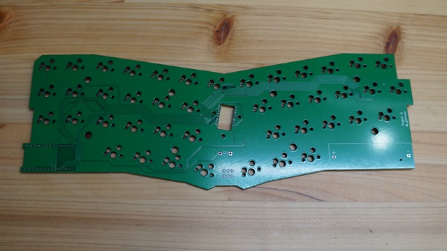|
|-|
|メインPCB 1個|
|<br>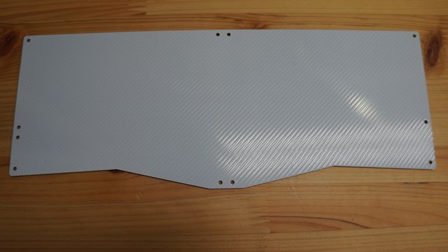|
|ボトムPCB 1個|
|<br>|
|トップPCB 1個|
|<br>|
|ミドルプレート 1個|
|<br>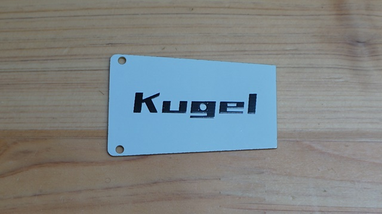|
|BLE Micro Proカバー 1個|
|<br>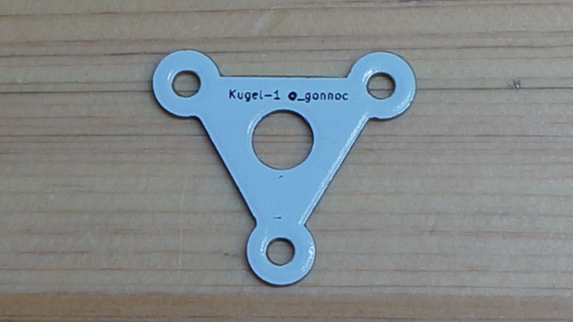|
|トラックボール用プレート 1個|
|<br>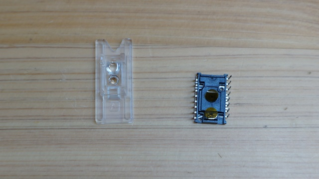|
|トラックボール用IC, レンズ 1セット|
|<br>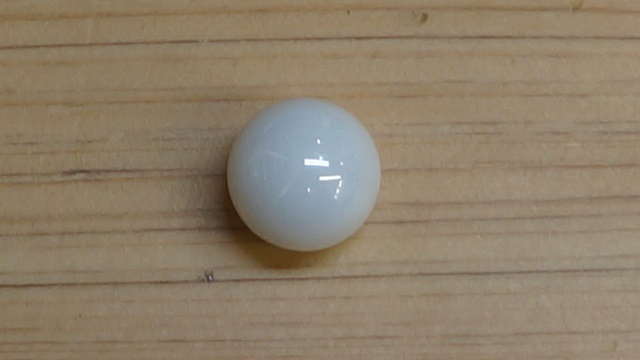|
|セラミックボール 1個|
|<br>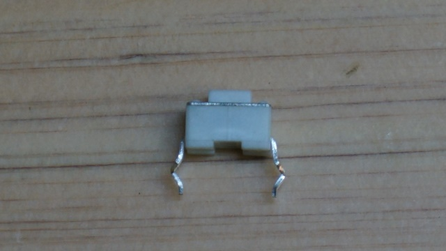|
|リセットスイッチ 1個|
|<br>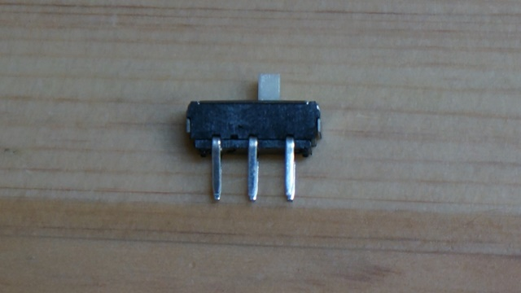|
|電源スイッチ 1個|
|<br>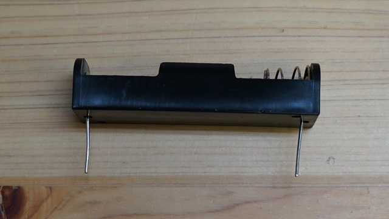|
|単三電池ケース 1個|
|<br>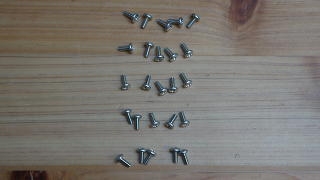|
|ネジ M2x5 25個|
|<br>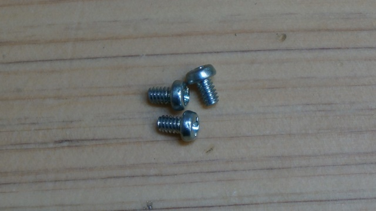|
|ネジ M2x3 3個|
|<br>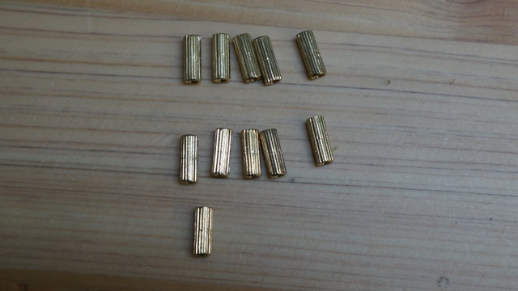|
|スペーサ M2x8 11個|
|<br>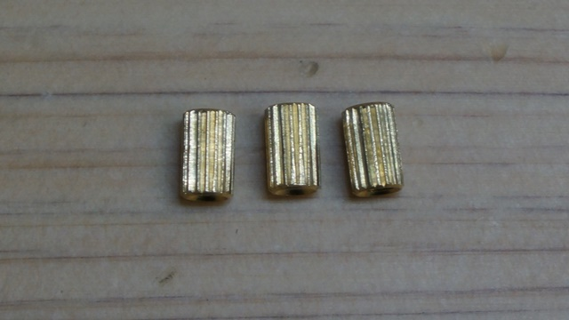|
|スペーサ M2x5 3個|

</p>
</details>

### 別途必要な部品
- BLE Micro Pro x1
  - [BOOTH](https://nogikes.booth.pm/items/1177319), [遊舎工房](https://yushakobo.jp/shop/ble-micro-pro/)にて販売中
- コンスルーまたはピンヘッダ x2
- タミヤ 楽しい工作シリーズ No.144　ボールキャスター 
  - 家電量販店や通販で購入できます
- 塩化チオニルリチウム電池 x1
  - 無線動作させる場合は3.6Vの電池が必要です。秋月電子などで購入できます
- MXソケット x43
- MX互換スイッチ x43
- MX用キーキャップ(1U) x43

<details><summary>パーツ画像一覧</summary>
<p>

|<br>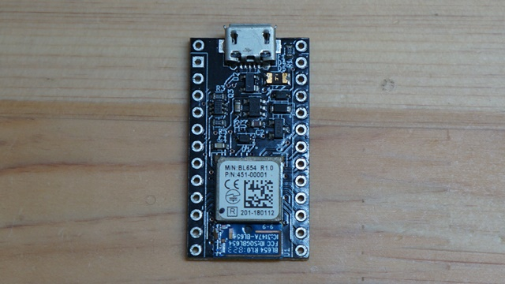|
|-|
|BLE Micro Pro 1個|
|<br>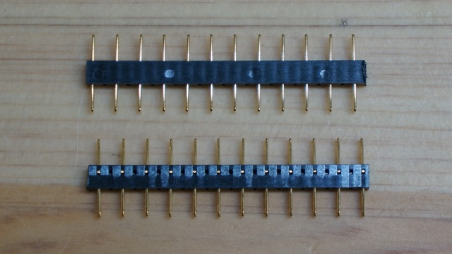|
|コンスルー 2個|
|<br>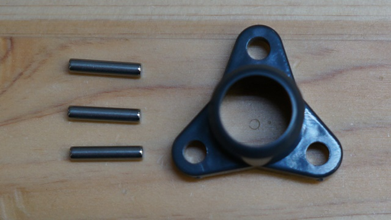|
|タミヤ ボールキャスター 1個|

</p>
</details>

### 工具の確認
- ハンダコテ、はんだ
- ニッパー
- ドライバー
- マスキングテープ

## 組み立て手順
1. (マウスICハンダ付け済み版の場合)スイッチ4つくらいとトッププレート、メイン基板、トラックボール、BLE Micro Proを仮組みし、トラックボールの動作確認をする
1. (マウスICハンダ付け済み版の場合)仮組みしたものを解体したうえで、メイン基板上のレンズが外れないようにマスキングテープで固定する。または、レンズを外した上でホコリが入らないようにマスキングテープでカバーする
1. スイッチソケットをはんだ付けする
2. トラックボール用ICをはんだ付けする
3. レンズ、リセットスイッチ、電源スイッチを差し込む
4. トッププレート、スイッチを取り付ける
5. トラックボールを取り付ける
6. リセットスイッチ、電源スイッチ、電池ボックスをはんだ付けする
7. スペーサーを取り付ける
8. BLE Micro Proを取り付けて動作確認する
9.  ミドルプレート、ボトムプレートを取り付ける
10. トラックボールの位置を調整する

### (マウスICハンダ付け済み版の場合)
- 先の手順を参考に、トラックボール部分を仮組みして動作確認をしてください

### スイッチソケットのはんだ付け
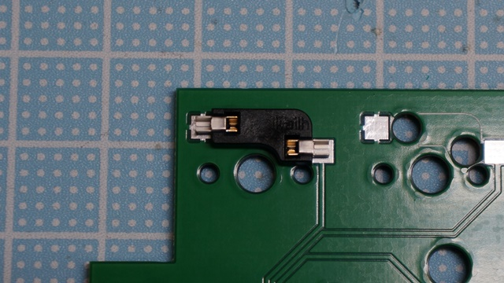
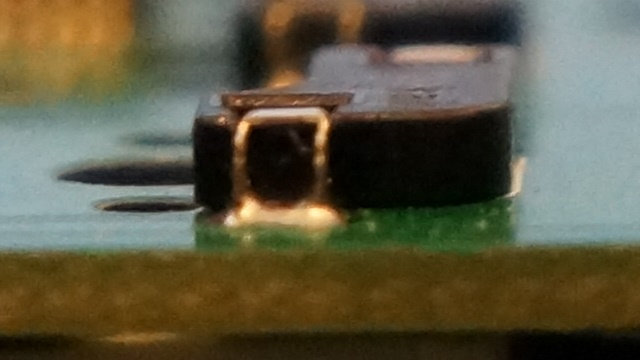
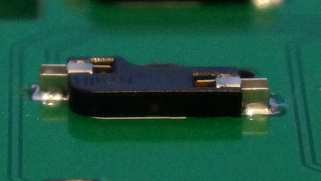
- スイッチ用ソケットをはんだ付けしていきます  
  - ソケットが浮き上がらないように注意してください  
  - 端子の左右にフィレットができるようにしっかりハンダを盛ってください

### トラックボールICのはんだ付け
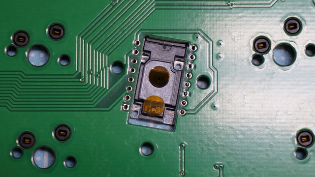
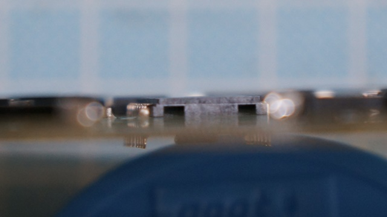
- PCBから浮かないようにトラックボールICをはんだ付けします  
  - 机の上に置いてはんだ付けするとICが浮いてしまうので、マスキングテープで固定したり指で裏側からICを押さえつけながらはんだ付けしてください
  - 写真をよく見て取り付ける向きを間違えないようにしてください

### レンズ、リセットスイッチ、電源スイッチを差し込む
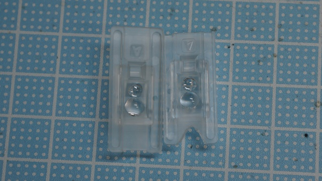
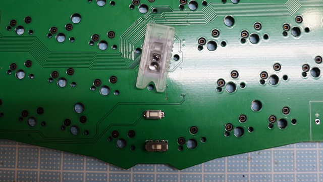
- リセットスイッチ、電源スイッチを差し込みます。**はんだ付けはまだしないでください**
- 写真を参考にニッパーでレンズの両端の一部をカットします  
  - 光学部分に変色などの影響が出ないように少しずつカットしてください  
- トラックボールICの保護シールを剥がし、レンズを取り付けます

### トッププレート、スイッチを取り付ける
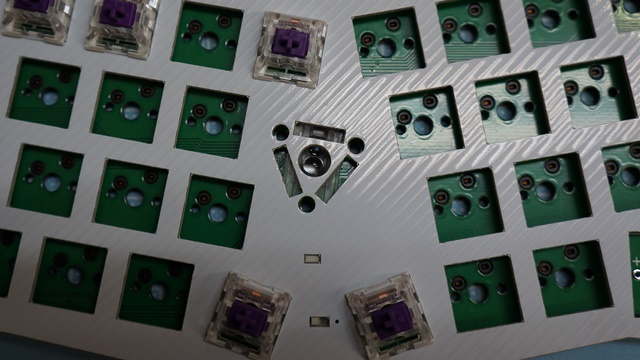
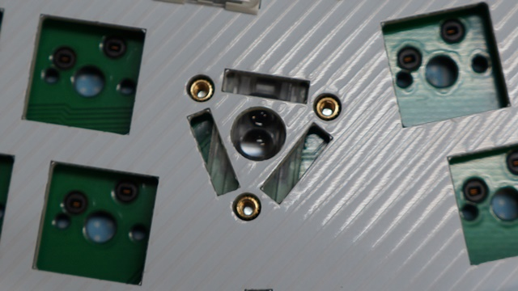
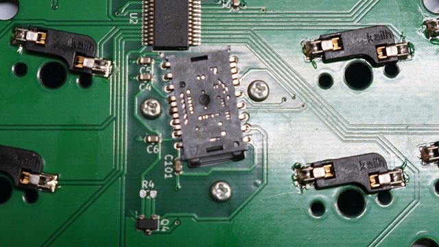
- トッププレートの上からスイッチをメインPCBに取り付けていきます  
  - ソケットが剥がれないようにメインPCBを机の上に載せて、真上からスイッチを押し込んでください
  - スイッチの足が机を傷つけないように上に作業用マットを敷いておきましよう  
- 4つくらいスイッチを取り付けるとトッププレートとメインPCBの位置関係が固定されます。リセットスイッチと電源スイッチがトッププレートの穴から操作できることを確認しておきましょう  
また、この時点でトラックボールの左上にスイッチを取り付けてもレンズと干渉しないことと、5mmのスペーサーとレンズが干渉しないことを確認してください
  - 干渉する場合は再度レンズをカットしてください
- 5mmのスペーサーをM2x3mmのなべネジで固定します
- スイッチの爪がトッププレートにはまっていることを確認しながら残りのスイッチを一個ずつ取り付けてください  

### トラックボールを取り付ける
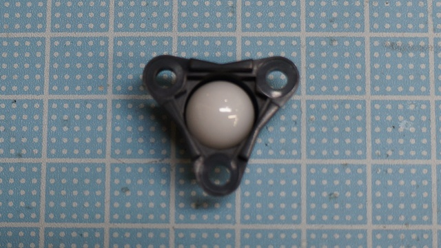
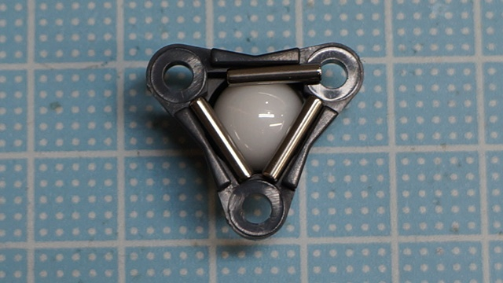
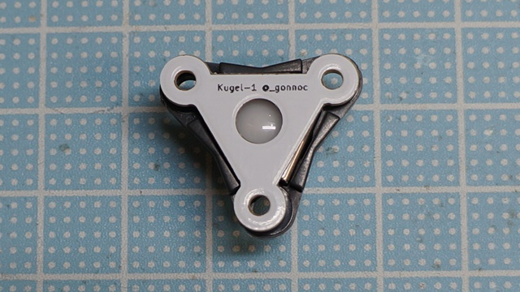
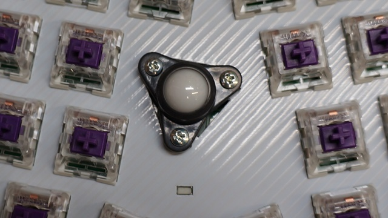
- ボールホルダーにセラミックボール、コロ、PCBプレートを入れます  
- 中身がこぼれないようにボールホルダーをひっくり返し、キーボードにネジ止めします

### リセットスイッチ、電源スイッチ、電池ボックスをはんだ付けする
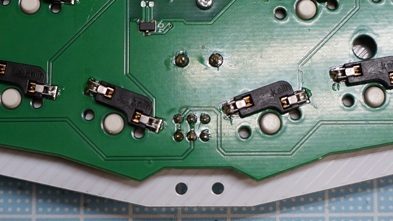
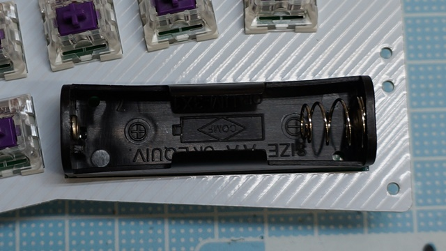
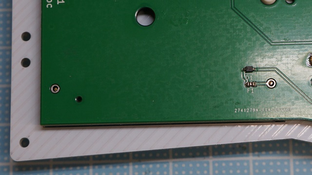
- リセットスイッチ、電源スイッチをはんだ付けします
- 電池ボックスを差し込み裏側からはんだ付けします。
  - なるべく電池ボックスの足が飛び出ないようにニッパーで切断してからはんだ付けしてください

### スペーサーを取り付ける
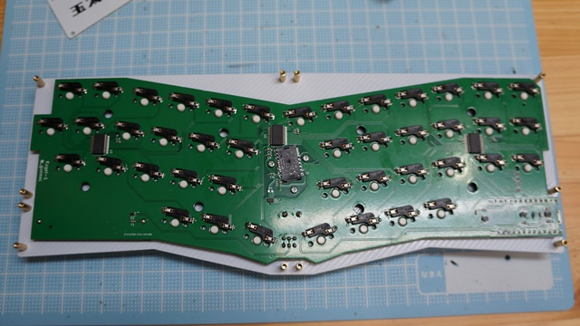
- 8mmのスペーサーをトッププレートの外周部にネジ止めします

### BLE Micro Proを取り付けて動作確認する
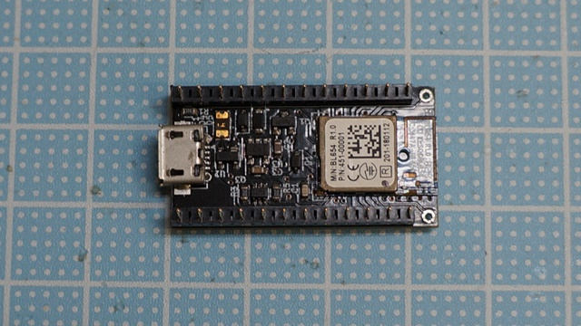
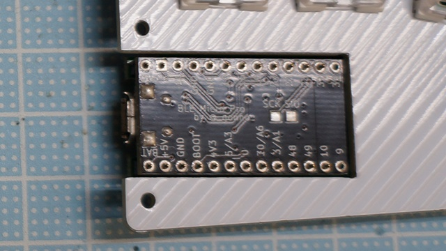
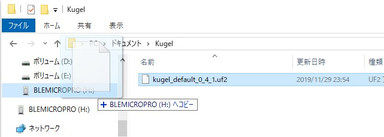
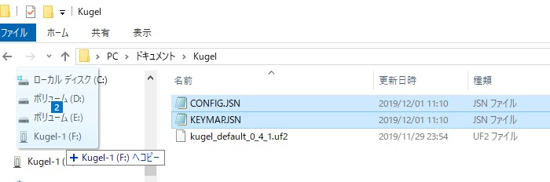
- BLE Micro ProのUSBコネクタ側に寄せてコンスルーを取り付けます。Pro Microと異なりはんだ付けは不要です  
- BLE Micro Proを**裏向き**でKugelに取り付けます  
  - 同様に、コンスルーをUSBコネクタ側に寄せて基板に取り付けます。浮かないようにしっかり差し込んでください
- BLE Micro Proのファームウェアをアップデートします
  - [https://github.com/sekigon-gonnoc/BLE-Micro-Pro/blob/master/AboutDefaultFirmware/doc/getting_start.md](https://github.com/sekigon-gonnoc/BLE-Micro-Pro/blob/master/AboutDefaultFirmware/doc/getting_start.md)
- Kugel用のファームウェアを書き込みます
  - [ビルド済みファームウェア](https://github.com/sekigon-gonnoc/Kugel-doc/releases)
- Kugel-1というドライブが認識されたら、中にあるSTATUS.TXTを開いて、ICがすべて認識されていることを確認してください
    ```
    IO exp1:OK
    IO exp2:OK
    IO exp3:OK
    Trackball:OK
    ```
- Kugel用のコンフィグ(CONFIG.JSN, KEYMAP.JSN)を書き込みます
  - キーマップを変更する場合、メモ帳で直接編集するか、MAPEDIT.HTMからQMK configuratorを開いてkeymap.jsonをダウンロードしてください
- USBでパソコンに接続してキー入力ができることを確認してください

### ミドルプレート、ボトムプレートを取り付ける
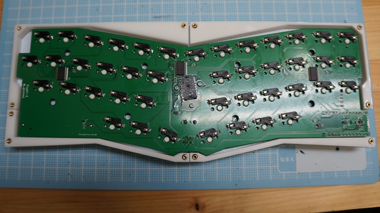
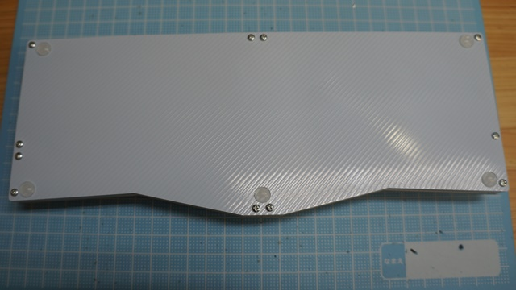
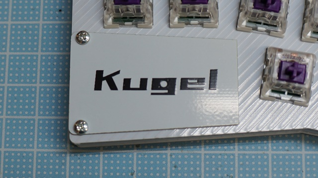
- ミドルプレートをはめこみ、ボトムプレートをネジ止めします  
  - ミドルプレートと上下のプレートの間に隙間が生じる場合がありますが、強度上は問題ありません
  - 気になる場合は吸振材などで隙間を埋めたり、別途公開予定の3Dプリント用ミドルプレートを使用してください
- ボトムプレートにゴム足を貼り付けます
- BLE Micro Proカバーを取り付けます
  - 構造上コンスルーと接触してカバーの端が浮く場合があります。気になる場合はコンスルーをはんだ付けした上でカットしてください 

### キーキャップを取り付ける
- スイッチにキーキャップを取り付けます

### トラックボールを調整する
#### トラックボールが反応するように取り付け位置を調整  
  - ボールを回してもカーソルが動かなかったり特定の方向だけ効きが悪い場合は、ICの検出範囲とボールの位置が合うように位置調整が必要です
  - 固定ネジを少し緩めると取り付け位置を動かせます。操作したときの反応を見ながら位置を決めてネジをしっかり締め付けます
  - 調整しろが足りない場合にはトラックボールホルダー側の爪の端をカットして調整範囲を広げてください
  - それでも調整できない場合は画像のようにトラックボール用プレートの穴をヤスリで広げます。また、ボールキャスターの穴も広げることで更に範囲を広げられます。後述のレーザー出力の調整も試してみてください
  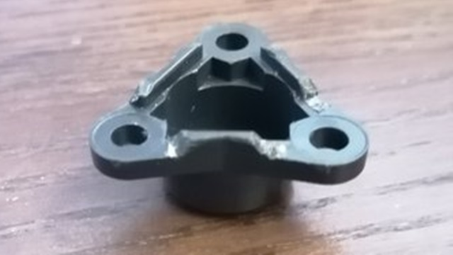
  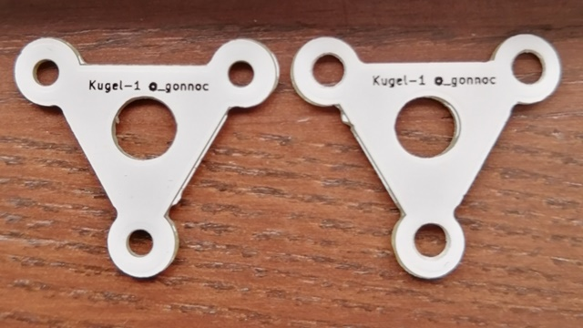

#### レーザーの出力の調整  
  - どこに置いても反応しない場合、レーザーの出力を下げます
  - まず、ファームウェアを`0.4.1-5`以上にアップデートします
  - CONFIG.JSNの`reserved`の1つ目の数値を調整します。127くらいに下げると反応する場合があるようです。弱すぎても反応しないので、様子を見ながら最適な値を探してください。
      | 値    | 意味                      |
      | ----- | ------------------------- |
      | 0     | デフォルト(=255)          |
      | 1~255 | レーザーの強さ(255が最大) |


### トラックボールの設定について
- デフォルトの状態では次のようになっています
  - ボールをゆっくり動かすと、通常時よりも感度が低くなります
  - レイヤ1に移動するとボールの感度が低くなります
  - レイヤ2に移動するとボールでスクロールできます
- トラックボールの設定を変更したい場合は[ファームウェアを自分でビルドする必要があります](Firmware.md)
