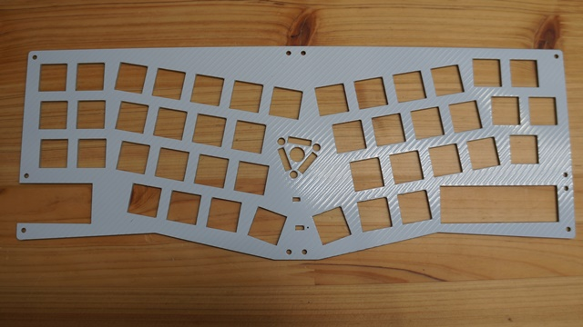
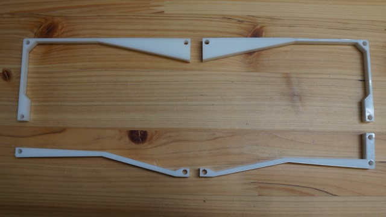
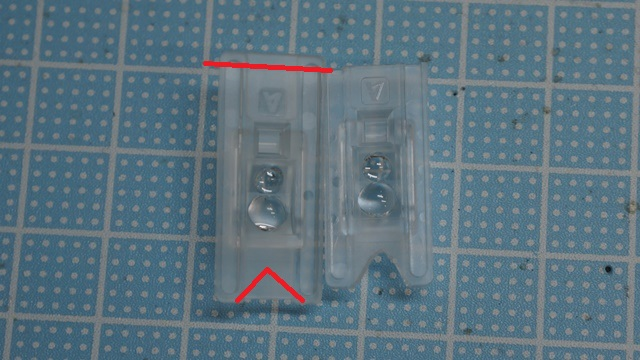

# Kugel-1 ビルドガイド

自作キーボードキットKugel-1のビルドガイドです  
組立前に必ず一回以上確認してください

## 準備
### キット内容の確認
- メインPCB
- トップPCB
- ボトムPCB
- アクリルミドルプレート
- 電池ボックス
- 電源スイッチ
- リセットスイッチ
- ネジ・スペーサー
- トラックボール用セラミックボール

パーツ画像一覧

| |
|-|
|メインPCB 1個|
| |
|ボトムPCB 1個|
| |
|トップPCB 1個|
| |
|ミドルプレート 1個|
| |
|BLE Micro Proカバー 1個|
| |
|トラックボール用プレート 1個|
| |
|トラックボール用IC, レンズ 1セット|
| |
|セラミックボール 1個|
| |
|リセットスイッチ 1個|
| |
|電源スイッチ 1個|
| |
|単三電池ケース 1個|
| |
|ネジ M2x5 25個|
| |
|ネジ M2x3 3個|
| |
|スペーサ M2x8 11個|
| |
|スペーサ M2x5 3個|

### 別途必要な部品
- BLE Micro Pro x1
- コンスルーまたはピンヘッダ x2
- タミヤ 楽しい工作シリーズ No.144　ボールキャスター 
  - 家電量販店や通販で購入できます
- 塩化チオニルリチウム電池 x1
  - 無線動作させる場合は3.6Vの電池が必要です。秋月電子などで購入できます
- MXソケット x43
- MX互換スイッチ x43
- MX用キーキャップ x43

パーツ画像一覧

| |
|-|
|BLE Micro Pro 1個|
| |
|コンスルー 2個|
| |
|タミヤ ボールキャスター 1個|

### 工具の確認
- ハンダコテ、はんだ
- ニッパー
- ドライバー
- マスキングテープ

## 組み立て手順
1. スイッチソケットをはんだ付けする
2. トラックボール用ICをはんだ付けする
3. レンズ、リセットスイッチ、電源スイッチを差し込む
4. トッププレート、スイッチを取り付ける
5. トラックボールを取り付ける
6. リセットスイッチ、電源スイッチ、電池ボックスをはんだ付けする
7. スペーサーを取り付ける
8. BLE Micro Proを取り付けて動作確認する
9.  ミドルプレート、ボトムプレートを取り付ける
10. トラックボールの位置を調整する

### スイッチソケットのはんだ付け

- スイッチ用ソケットをはんだ付けしていきます  
  - ソケットが浮き上がらないように注意してください  
  - 端子の左右にフィレットができるようにしっかりハンダを盛ってください

### トラックボールICのはんだ付け

- PCBから浮かないようにトラックボールICをはんだ付けします  
  - 机の上に置いてはんだ付けするとICが浮いてしまうので、マスキングテープで固定したり指で裏側からICを押さえつけながらはんだ付けしてください
  - 写真をよく見て取り付ける向きを間違えないようにしてください

### レンズ、リセットスイッチ、電源スイッチを差し込む

- リセットスイッチ、電源スイッチを差し込みます。**はんだ付けはまだしないでください**
- 写真を参考にニッパーでレンズの両端の一部をカットします  
  - 光学部分に変色などの影響が出ないように少しずつカットしてください  
- トラックボールICの保護シールを剥がし、レンズを取り付けます

### トッププレート、スイッチを取り付ける

- トッププレートの上からスイッチをメインPCBに取り付けていきます  
  - ソケットが剥がれないようにメインPCBを机の上に載せて、真上からスイッチを押し込んでください
  - スイッチの足が机を傷つけないように上に作業用マットを敷いておきましよう  
- 4つくらいスイッチを取り付けるとトッププレートとメインPCBの位置関係が固定されます。リセットスイッチと電源スイッチがトッププレートの穴から操作できることを確認しておきましょう  
また、この時点でトラックボールの左上にスイッチを取り付けてもレンズと干渉しないことと、5mmのスペーサーとレンズが干渉しないことを確認してください
  - 干渉する場合は再度レンズをカットしてください
- 5mmのスペーサーをM2x3mmのなべネジで固定します
- スイッチの爪がトッププレートにはまっていることを確認しながら残りのスイッチを一個ずつ取り付けてください  

### トラックボールを取り付ける

- ボールホルダーにセラミックボール、コロ、PCBプレートを入れます  
- 中身がこぼれないようにボールホルダーをひっくり返し、キーボードにネジ止めします

### リセットスイッチ、電源スイッチ、電池ボックスをはんだ付けする

- リセットスイッチ、電源スイッチをはんだ付けします
- 電池ボックスを差し込み裏側からはんだ付けします。
  - なるべく電池ボックスの足が飛び出ないようにニッパーで切断してからはんだ付けしてください

### スペーサーを取り付ける

- 8mmのスペーサーをトッププレートの外周部にネジ止めします

### BLE Micro Proを取り付けて動作確認する

- BLE Micro ProにKugel用のファームウェアを書き込みます  
- BLE Micro ProのUSBコネクタ側に寄せてコンスルーを取り付けます。Pro Microと異なりはんだ付けは不要です  
- BLE Micro Proを裏向きでKugelに取り付けます  
- USBでパソコンに接続してキー入力ができることを確認してください

### ミドルプレート、ボトムプレートを取り付ける

- ミドルプレートをはめこみ、ボトムプレートをネジ止めします  
- ボトムプレートにゴム足を貼り付けます

### トラックボールの位置を調整する
- トラックボールが反応するように取り付け位置を調整します  
  - 調整しろが足りない場合にはトラックボールホルダー側の爪の端をカットして調整範囲を広げてください

